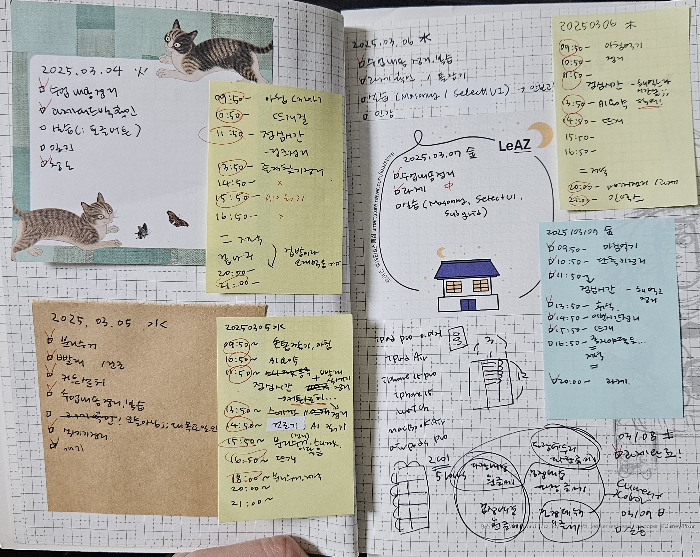

# 5주차 회고

### 🔹 5주차 회고를 시작하며

하루는 길고, 일주일은 금세이고 한 달은 눈 깜빡하면 지나가는 거 같아요.  
정신을 똑바로 안 차리면 눈 녹듯 사라지는 시간에 마음만 조급하고, 가끔은 조금 지치는 날도 있습니다.

이번주는 사실 좋은 한 주는 아니었습니다.
코피가 2번 나고 낮에는 열이 좀 나는 등 컨디션도 안 좋았을 뿐더러 나름 정들었던 회고조에서 조원 한 분 빠지게 되면서.. 아쉽기도 하고 안타깝기도 하고 여러모로 마음도 좋지 않았습니다.  
다양한 이유로 조금 싱숭생숭한 시기가 아니였나 싶습니다. 어쩌면 4일만 수업이 있어서 다행이었을 정도로요.

그래도 주말이 오고 과제를 하면서 엄청 집중해서 코드를 짰는데, 진짜 재밌어서 시간이 가는 줄 모르고 했습니다.  
새삼 제가 왜 이 길을 선택했는 지가 생각나서 조금 기운이 났어요.

이제 다시 좋았던 시간을 곱씹으며 힘을 내서 하루하루를 아쉽지 않게 보내봐야겠죠.  
아무것도 하지 않으면 아무것도 변하지 않으니까요!

이번주는 5 Whys 방식으로 회고를 정리하려고 합니다.

> **5 Whys 방식이란?**
>
> 문제가 발생했을 때, "왜?"라는 질문을 5번 반복하여 근본적인 원인을 찾아내는 방법
>
> - **방법:**  
>   해결하고 싶은 문제를 정의 하고 "왜?"를 5번 반복하며 원인을 깊이 파고듭니다.
>   최종적으로 해결책을 도출합니다.
>
> `-->` **깊은 고찰을 통해 해결하고자 하는 문제의 근본적인 원인을 파악하고 그에 대한 해결책을 찾아낼 수 있음**

 

### 🔹 5주차 회고 내용 (feat. 5Why 방식)

이번주는 악조건 속에서도 열심히 해보려고 했으나 아무리 생각해봐도 학습한 내용이 머릿속에 잘 자리잡지 못한 느낌이었는데요, **원인**을 곰곰히 생각해보니 실습이 많이 필요한 부분을 배웠는데 _`실습을 많이 해보지 않아서`_ 그렇다고 판단 됩니다.

**왜** 실습을 충분히 해보지 않았냐 생각해보니, _`컨디션 난조`_ 라는 이유로 생활패턴을 바르게 되돌리려고 일찍 잠자리에 들다보니 하루 안에 필요한 만큼의 학습 시간을 가지지 못한 듯 합니다.

**왜** 컨디션이 안 좋아졌나 생각해보니 주말/연휴 동안 _`수면이 충분하지 않았습니다.`_ 하루에 4~5시간 정도 잔 거 같아요.

**왜** 그런가하니..연휴를 믿고 과제, 공부 등의 _`할 일을 조금씩 미룸`_ + 연휴 동안 스케쥴이 많아서 충분히 쉬지 못함 이렇게 2가지 콜라보레이션의 결과물이었다는 결론이 났습니다.

**왜** 미뤘을까요... 아마도 할 수 있다는 _`근거 없는 자신감`_ 이 문제인 듯 합니다.
예상치 못한 일이 벌어져도 제때 해결할 수 있도록 계획을 짤 때 버퍼타임을 넣어야 하는데, 자꾸만 **"최상의 컨디션으로"** **"최상의 조건에서"** 달성 가능한 시간으로 짜는 안 좋은 습관이 있다보니 달성을 못하고 계속 미뤄지는 상태!

<정리>  
 **문제점: 학습이 더뎌짐**
| No. | Why? |
| :-: | :--------: |
| 1 | 실습 불충분 |
| 2 | 컨디션 난조 |
| 3 | 수면 부족 |
| 4 | 할 일 미룸 |
| 5 | 근거 없는 자신감을 갖고 계획을 짬 |

=> 결론:

1. 스스로의 능력에 대해 잘 파악하고 계획 짜기
2. 짜놓은 계획을 잘 지키기
3. 혹시 못지켰을 경우 유동적으로 잘 조정하기

이러한 상황을 반복하지 않기위해... 단기적으로는 잘세운 계획을 잘 지켜야 하고 장기적으로는 자신감의 근거를 길러야 할 거 같습니다.

말이란 건 언제나 내뱉기는 참 쉽고 지키기는 참 어렵습니다...  
다음주는 부디 건강하고 뿌듯한 한 주가 되기를 바라며, 금주의 회고를 마쳐봅니다.

