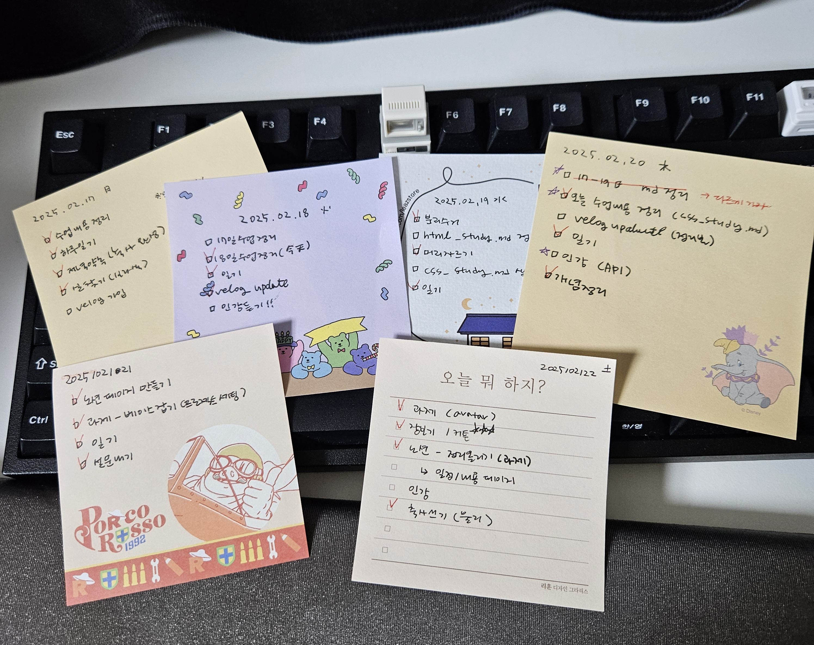

# 3주차 회고

### 🔹 3주차 회고를 시작하며

이번 주차는 HTML의 다양한 요소들에 대해 배우고 CSS 파트로 넘어가는 중요한 주였습니다.  
솔직히 저번 주차는 초반인지라 수업 후에 개인 정리를 마치고, 스터디를 하고 별도의 공부까지 할 시간이 나는 정도였습니다.  
그래서 '조금 더 익숙해지면 다른 언어 공부도 병행하자\!\^\^' 라는 생각이 있었지만 목\-금 CSS 통곡의 벽을 마주치고 나서 모든 계획을 전면 수정할 필요를 느꼈습니다. 지키지 못할 계획은 허상이니까요.

개발자로 2년 반이나 일했지만 솔직히 CSS에 대해 깊게 생각해본 적이 없었습니다.  
운영했던 서비스가 일부 사용자만 대상으로 하는 서비스였기 때문에 디자인보다는 기능을 중요시했기도 하고,
함께 일했던 팀장님이 백엔드를 중시하고 '프론트는 템플릿 받아서 그대로 쓰면 돼~' 하는 분이셨기 때문일 수도 있을 거 같아요.

물론 템플릿을 받아서 시작해도 막상 구축이 진행되니 반 이상 뜯어내고 사실상 템플릿은 느낌만 나는 정도가 되었지만... 어쨌든 프론트 쪽은 제 손으로 시작부터 만들어본 적이 없기 때문에 지금 배우는 지식이 굉장히 값지게 느껴집니다.  
좀 근본 없는 인테리어 업자였다가 건축의 기초부터 배우는 느낌?
지식의 뿌리가 없으니 항상 '이게 맞나..저게 맞나.. 왜 이렇게 되는 거지? 이게 돌아가니까 이렇게 가자' 이런 식의 어리둥절 개발만 했었는데, CSS 배우면서 정말 아하! 의 연속입니다.  
어렵지만 솔직히 재밌어요 ㅋㅋㅋ 잘하고 싶어요!

쓰다보니 서론이 길어졌네요. 저번 주는 KPT방식으로 회고를 정리했었는데, 금주차는 **SSC방식**으로 회고를 정리해보려고 합니다.

> **SSC (Start, Stop, Continue) 방식이란?**
>
> - **Start (시작)**: 앞으로 새롭게 시도할 활동, 시도해보고 싶은 것
> - **Stop (중단)**: 이제 그만두 것, 효과가 없거나 불필요한 프로세스, 문제 요소 등
> - **Continue (지속)**: 계속 유지할 것, 긍정적인 영향이 있는 부분

> `-->` **빠르고 직관적으로 기존의 장점을 유지하면서도 개선할 수 있는 방향을 향해 나아갈 수 있음**

※ 정리하다보니 작주에 진행한 KPT 방식과 유사한 거 같아서 비교점을 찾아보니 요렇게 정리할 수 있다고 합니다.

| 회고 방식 |         의미          | 특징            | 활용 사례                |
| :-------: | :-------------------: | :-------------- | :----------------------- |
|    SSC    | Start, Stop, Continue | 간단하고 직관적 | 팀 회고, 개인 성장 회고  |
|    KPT    |  Keep, Problem, Try   | 문제 해결 중심  | 프로젝트 리뷰, 기술 회고 |

<br />

### 🔹 3주차 회고 내용 (feat. SSC 방식)

이번주는 정말 눈에 띄게 체크리스트를 못 지킨 한 주가 아니었나 싶습니다.  
큰 원인을 분석하자면 아마도 **정리에 대한 집착!**

지난 주에 markdown 문법으로 과제파일을 작성하면서 하나의 문서로 깔끔하게 정리하는 것에 큰 만족감을 느꼈습니다.
그래서 이번주는 야심차게 아래와 같은 목표를 세워봤는데

> 하루치 수업 내용을 한 눈에 볼 수 있게 md파일로 정리하고 velog에 업로드하자!

하지만 익숙치 않은 내용을 익숙치 않은 방식으로 정리하다보니 예상보다 시간이 오래 소요되면서,  
할 일들이 밀리기 시작했고 결국 다 마치지 못했습니다.  
무엇보다도 한 번 밀리기 시작하니까 분량은 걷잡을 수 없이 늘어나고,  
꼭 하려고 했던 일들을 못하면서 **마음만 무거운 채** 시간이 지나가서 제법 스트레스 받은 한 주...

velog 업로드라는 목표를 세우니 _혼자만 보는 공간이 아니라고 생각돼서_ 정리하는데 더 손이 많이 가고,  
익숙치 않는 방식으로 하다보니 공부가 되는 게 아니라 **보여주기 식으로** 작성하고 있다는 걸 점점 느끼게 됐습니다.

한 주가 끝나가는 시점에서야 이론만 빼곡히 정리하는 게 소용 없다는 점과 오히려 부담감에 더 손 놓게된다는 점을 깨닫고 방식을 바꾸기로 결정했습니다. **5초 들여서 검색하면 찾을 수 있는 내용을 2~3시간씩 들여서 정리할 필요가 없다**는 생각이 들었기 때문에, 앞으로는 수업시간에는 딱 집중해서 수업을 듣고 끝나면 잊어버리기 전에 키워드만 바로 정리해두는 방식으로 변경하려고 합니다.  
velog는 오픈된 곳이니 기록은 노션에 개인적으로 정리하고, 정말 공유하면 좋을 내용만 velog에 업로드 하는 것으로 결정했습니다.

그리고 기존에는 정해둔 목표가 밀리면 다음날로 이전시켜서 꼭 수행하려고 했는데 이 부분 때문에 스노우볼이 굴러서 주말이 다가올수록 더 지치고 스트레스만 받게 되는 듯 합니다. 지연되는 사항에 대한 스트레스를 너무 받지 않기 위해 일부 반복되는 목표(ex\_인강 듣기)는 그 날 못하면 삭제처리하고 다음 날짜에 수행하는 걸로 변경합니다.

```

#### Start (시작)

- 수업 정리는 키워드만, 당일 수업 끝난 후 30분 내로 끝내기
- 노션에 수업 정리한 내용 + (가능한 날) 회고 정리하기
-

#### Stop (중단)

- 매일 하루치 수업 내용을 md파일로 정리하기 -> 키워드, 포인트만 노션에 정리하기
- 수업 내용 정리한 걸 velog 업로드하기  -> velog는 공유 목적으로 사용
- 완료 못한 일정 다음날로 미루기  -> 깔끔히 포기하고 다음 예정일에 꼭 하기

#### Continue (지속)

- 매일 To do List 작성, 달성 여부 체크
- 주 3회 이상 인강 듣기

```

큰 계획에서 봤을 때, 현재 시점에서 학습의 큰 목표는 2가지입니다.

1.  수업 내용을 이해하고 정리
2.  인터넷 강의를 끝내기

항상 1번이 최우선사항이고, 이번달 내에 듣고 있는 인강이 마무리되면 그 자리에 사이드프로젝트를 넣거나 다른 언어 공부를 넣을 예정입니다.

이번 주의 고통과 모든 지연사항을 반면교사 삼아서, 차주부터는 더 효율적으로!  
지식을 보관하는 곳이 **노트가 아니라 머리가 되는** 한 주가 되기를 바라봅니다.

<br />


