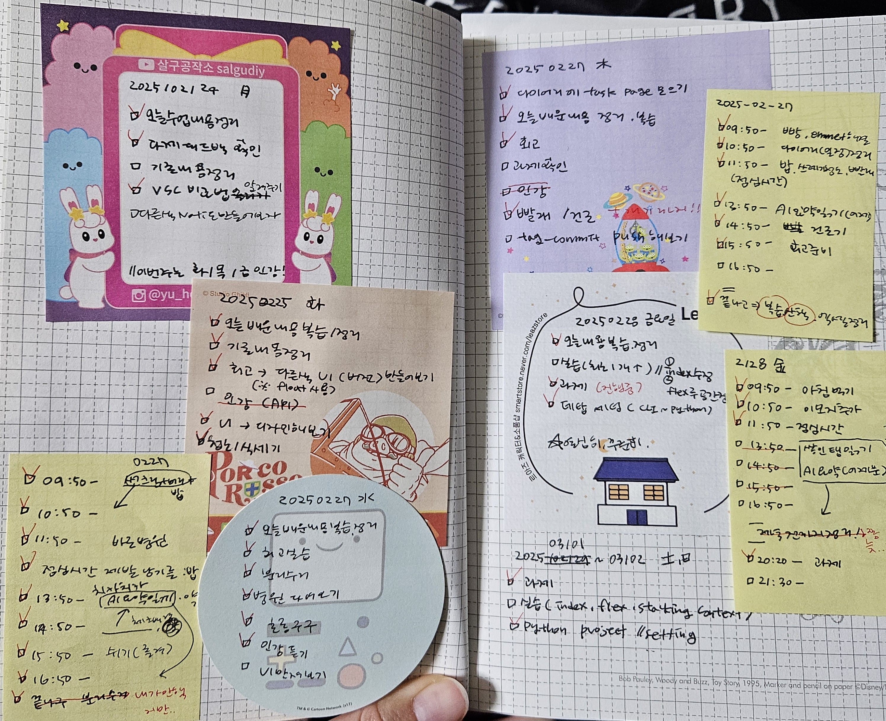

# 4주차 회고

### 🔹 4주차 회고를 시작하며

벌써 부트캠프가 시작한 지 **한 달**이 다 되어가네요.  
시간이 정말 빠른 거 같습니다. 이제 슬슬 수업과 과제에 적응해가는 스스로가 보입니다.

처음 개발을 시작했을 때 빈 화면을 보면서 느꼈던 막막함과 늦게까지 야근하면서 저를 괴롭게 했던 고민들이, 차근차근 기초를 채워감에 따라 조금씩 해소되는 느낌입니다.  
아직도 가야할 길은 멀고 해야할 일은 산더미 같으니 꾸준히 노력해야하겠지만, 어제의 나보다 더 나은 오늘의 내가 되기를 바라며 한발 씩 나아가려고 합니다.

어쨌든 종합적으로 만족스러운 한 주였습니다. 이 느낌을 계속 이어나가고 싶어요!  
즐거웠던 이번주는 4Ls 방식으로 회고를 정리하려고 합니다.

> **4Ls (Liked, Learned, Lacked, Longed for) 방식이란?**
>
> - **Liked (🌟)**: 좋았던 점, 마음에 들었던 점
> - **Learned (✨)**: 새롭게 배운 점
> - **Lacked (🛠️)**: 부족했던 점
> - **Longed for (💭)**: 더 있었으면 좋았을 부분, 바라는 점

> `-->` **좋았던 점, 부족한 점 뿐만 아니라 배운 내용을 함께 정리할 수 있고 특히 "Longed for" 항목을 통해 앞으로 어떤 부분을 개선하거나 추가해야 할지를 자연스럽게 도출할 수 있음**

<br />

### 🔹 4주차 회고 내용 (feat. 4Ls 방식)

이번주는 지난주보다 나은 한 주였던 거 같습니다.  
완벽하진 않지만 지난주에 세웠던 계획에 따라 목표들이 조금씩 달성되면서 제법 뿌듯함을 느끼기도 했고,  
어제/오늘은 과제를 하면서 또 많은 걸 배운 거 같아서 기분이 좋습니다.

특히 이번주부터 하루의 목표 뿐만 아니라 **각 쉬는 시간의 계획을 짜서 실행**해봤는데, 요게 시간 운용에 도움이 됐습니다.  
수업 중에 '아 이번 시간 끝나면 ~~해야겠다' 생각하고도 막상 50분이 되면 까먹는 경우가 정말 많았는데,  
떠올랐을 때 바로 적어두고 차곡차곡 하루치를 정리해두니까 시간을 보다 효율적으로 쓸 수 있고, 별 거 아니여도 하루가 끝날 때 뿌듯해요.

지난주와는 달리 이번주는 정말 수업이 끝나고 나서 1시간 내에 **키워드만/간단히/중요한 것만** 정리를 끝내자는 목표로 복습을 진행했습니다. 회고 시간에도 내용 정리보다는 그 날 배운 내용을 눈으로 한 번 훑고 함께 질문을 해결한다는 느낌으로 접근하니 확실히 평소보다 더 도움이 많이 됐습니다. 조원들끼리 의견 나누고 직접 해보니까 머리에 더 잘 들어오는 거 같아요.

다만 정리가 끝나고 느끼는 해방감을 주체하지 못하고 놀다가 계획했던 공부가 늦게 끝나면서 수면량이 다시 줄었습니다... 다음주 목표는 11시 30분에 꼭 자는 걸로 세웠습니다. 잠이 부족하면 집중력이 떨어지고 그만큼 효율이 안 좋아서 악순환이 오는 거 같아요. **주말동안 수면부족 악순환 끊어내기!!**

```
#### Liked
- 쉬는 시간의 할 일 리스트 작성해서 실행
- 정리는 핵심만 간단히, 실습과 예제 위주로 학습
- 회고 시간의 예제풀이나 궁금증 해결이 좋았음

#### Learned
- 다양한 CSS 활용 요소를 배우고 사용해봄
- 윈도우 환경에서의 파이썬 세팅 방법

#### Lacked
- 개념이 어렴풋이 이해된 상태->완벽하게 이해할 수 있게 더 활용해보기
- 수업시간 종료 후의 세부계획이 미흡해서 수면부족으로 이어짐

#### Longed
- 더 체계적이고 실행가능한 계획 세우기(장기/단기/극단기)
- 의지가 약해지지 않도록 셀프 동기부여하기
```

벌써 3월이네요. 교육의 6분의 1이 끝났다는 사실을 믿고싶지 않습니다.  
다음주는 더 만족스러운 한 주가 되기를 바라며 회고를 마칩니다.


